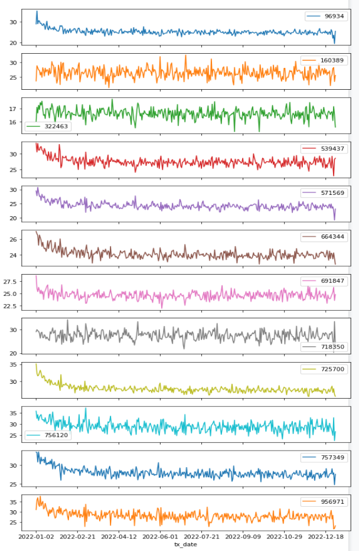
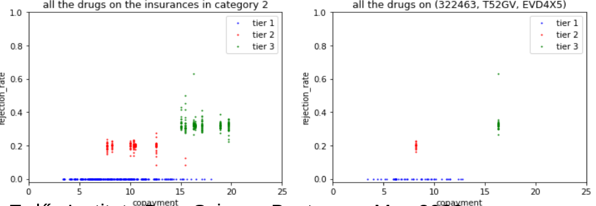
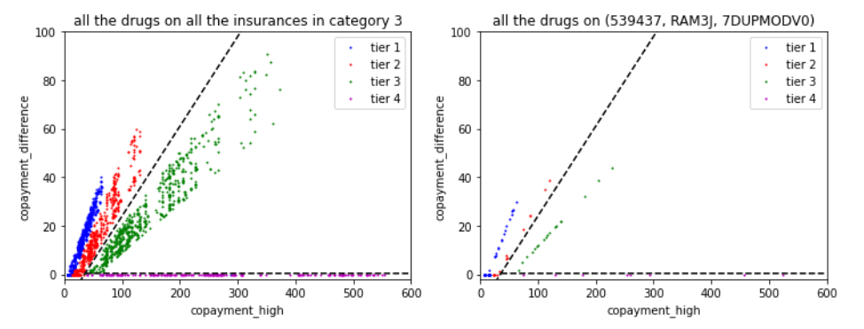

# CMM_Challenge
CoverMyMeds challenge held at the Erdös Institute, May of 2022.

## Overview
### Problem Context

Companies like CoverMyMeds have access to a large quantity of pharmacy transaction data. Our goal is to extrapolate from this data information about the expenses that patients should expect to see at the pharmacy, which is relevant to the patients as well as healthcare providers.

The expenses that patients actually pay for prescription drugs are determined by complicated interactions between drug manufacturers, insurance companies, and pharmacies. While official coverage information from insurance companies, as well as information about manufacturer discount programs, can be difficult to track down, data about individual transactions is abundant. For example, the dataset provided by CoverMyMeds for this project is simulated to model such real-world data sets. 

The purpose of our project is to predict patients’ out-of-pocket pay and drugs’ formulary status for each insurance plan, directly from a large database of transaction data.
This helps patients save money on prescriptions, and also helps doctors to make an informed decision about medication costs when prescribing medications. 

### The Dataset

A glimpse of the data:
 + 13.9 million entries
 + 114 drugs
 + 133 diagnosis codes
 + 61 insurance plans
 + 7.8% rejected claims

We see higher out-of-pocket pay early in the year compared to later in the year

Although we see this effect more clearly for some BINs than others: 

Also, we see that branded drugs tend to be more expensive and to get rejected more often:

### Our Approach

The main phases of our project:

 + **Data Exploration**: The data consists of around 14 million pharmacy data-billing claims simulated by CoverMyMeds. Researched insurance plans and explored factors impacting the variation of copayments with respect to the time of year, pharmacy and insurance plans.

 + **Copay prediction**: Introduced new features by feature engineering and predicted copayments with an average 4% MAPE.

 + **Formulary prediction**: Predicted formulary status of each medication on an insurance plan based on discount offered on each medication and rejection rates.

 + **Medication clustering**: Clustered drugs based on similar rejection rates and copayment requirements on Type 1 and Type 2 insurance plans. Clustered drugs based on deductible and coinsurance for Type 3 insurance plans.

## Out-of-Pocket Payments
### Observations
For each combination of (drug, insurance plan, pharmacy) there are either one or two values of patient_pay. 
Generally, we see the higher copay early in the year. This is due to the deductible phase.
### Preprocessing 
Using exploratory analysis we extract 8 important features that would help predict patient pay.
Truncating duplicates from training data to improve model performance.

Here is a heatmap of the correlations between the 8 aggregate features.
The high correlation suggests we should use regularized regression or tree-based models. 

### Prediction Models
We used Ridge Regression, Truncated Ridge Regression, Random Forests, and Gradient Boosting models. 
We chose Random Forests as our final model (with a 4% MAPE score and 0.99 explained variance).

### Metrics
We used a variety of metrics such as explained variance(r^2 score), MAE, RMSE and MAPE to compare our models. 

### Error Analysis
Error Analysis: We observed more mismatch between our prediction and actual patient pay for copay-before-deductible entries.
We recommend another model which predicts the copay-before-deductible if the doctor is interested in
knowing out-of-pocket pay before the deductible phase starts

## Formulary Status

Insurance plans determine drug prices based on a *formulary*:
A classification of drugs into tiers which determine how coverage is applied. 
The number of tiers varies from plan to plan, but in general, higher tiers include
non-preferred, branded or specialty drugs, and have higher rejection rates, costs, and deductibles, 
while lower tiers include preferred and generic drugs, and have lower rejection rates, costs, and deductibles. 

Although the above heuristic holds as a general rule, different insurance plans differ in their specifics between different plans. 
Our motivating question is: from the data alone, can we predict drug tiers for each plan? We thought of this as a clustering problem. 

### Three types of Plans
We used a Gaussian mixture model to separate higher drug costs early in the year from lower costs later in the year. 
We assume this effect is due to a deductible phase in the beginning of the year.
But because not every insurance plan has deductibles, there are not always two distinct price clusters:

By scatter-plotting drugs according to their early-year copays and the difference between their early- and late-year copays, 
we identify three main categories of insurance plans: 

These categories are characterized by the following behavior:

**Category 1)** A wide range of copays, and no deductible. This category includes 23 plans
**Category 2)** A small range of copays, and no deductibles. This category includes 7 plans
**Category 3)** A wide range of copays, and a deductible phase that is followed by a coinsurance phase,
corresponding to the x-intercept and the slopes of the rays in the above graph. This category includes 33 plans. 

### Drug Tiers 
#### Type 1

#### Type 2

#### Type 3 

## Next Steps 

 + Make a supplemental model to predict out-of-pocket pay in the deductible phase for the early months of the year.

 + Cluster preferred drugs based on the diagnoses they treat and compare how they differ across insurance plans. Help patients choose insurance plans based on their prescription needs.

 + Identify preferred in-network and out-of-network pharmacies for each insurance plan.

 + Deploy our model in an application that helps patients and doctors compare insurance plans, pharmacies, and medications with cost in mind. 

## References
[uspharmacist.com/article/a-pharmacists-primer-on-prescription-discount-cards](https://www.uspharmacist.com/article/a-pharmacists-primer-on-prescription-discount-cards)
[bcbsm.com/medicare/help/understanding-plans/pharmacy-prescription-drugs/tiers.html](https://www.bcbsm.com/medicare/help/understanding-plans/pharmacy-prescription-drugs/tiers.html)
[goodrx.com/insurance/health-insurance/medication-formulary](https://www.goodrx.com/insurance/health-insurance/medication-formulary)
[patientadvocate.org/explore-our-resources/understanding-health-insurance/understanding-drug-tiers/](https://www.patientadvocate.org/explore-our-resources/understanding-health-insurance/understanding-drug-tiers/)
[healthinsurance.org/faqs/whats-the-difference-between-prescription-discount-plans-and-prescription-drug-insurance/ ](https://www.healthinsurance.org/faqs/whats-the-difference-between-prescription-discount-plans-and-prescription-drug-insurance/ )
[covermymeds.com/main](https://www.covermymeds.com/main/)
